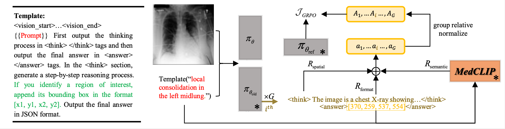

## MedGround-R1: Advancing Medical Image Grounding via Spatial-Semantic Rewarded Group Relative Policy Optimization 
### [`MICCAI'25 Best Paper Shortlist`](https://arxiv.org/abs/2507.02994) | [`BibTeX`](#citing) 

<p align="center">
  
</p>

This is the official implmentation of MedGround-R1, which incorporates **[GRPO](https://github.com/bio-mlhui/MedGround-R1/blob/ccf28f21f474a60bfcdeb9883a60586a7f3b6c6a/open-r1-multimodal/src/open_r1/trainer/grpo_trainer.py#L359)** and **[ MedCLIP semantic reward](https://github.com/bio-mlhui/MedGround-R1/blob/ccf28f21f474a60bfcdeb9883a60586a7f3b6c6a/open-r1-multimodal/src/open_r1/grpo_rec.py#L236)**. Without any cold start sft or cot annotation, MedGroud-R1 achieves sota on three public medical grounding benchmarks.

## TIMELINE (Updating)
- [ ] upload checkpoints and logs.
- [x] 09/24 upload dataset and log for MS-CXR 
- [x] 09/01 miccai'25 **best paper shortlist** 😊 
- [x] 08/10 miccai'25 splotlight
- [x] 07/01 camera ready paper upload to arxiv 
- [x] 05/10 miccai'25 early accept 

## Announcement
The author is committed to fully open-access and transparency, all checkpoints will be uploaded before 10/08 holiday. 

## Items
1. Installation for VLM-R1: Our repo is based on VLM-R1, please refer to [vlm-r1](https://github.com/om-ai-lab/VLM-R1) for installation guidance.
2. Installation for MedCLIP: Please refer to [medclip](https://github.com/RyanWangZf/MedCLIP) for installation guidance. 

3. Training: 
Using 8 H100 80G:
```
cd open-r1-multimodal/src/open-r1
bash run_grpo_rec.sh
```

4. Evaluate:
```
python eval/test_rec_r1_med_qwen25.py
```

5. logs, checkpoints, predictions

| Backbone| Dataset | mIoU | Acc  | log | ckpt | 
| :----: | :----: | :----: | :----: | :----: | :----: |
| Qwen2.5VL-7B | MS-CXR | 79.02 |83.12 | [log](/eval/logs/rec22_results_cxr_test_qwen2_5vl_7b_instruct_r1_450.json) |  |
| Qwen2.5VL-7B | ChestX-ray8 | 53.12 | 62.18 |  |  |
| Qwen2.5VL-7B | M3D-RefSeg | 60.10 | 74.66 |  |  |


## citing
```
@article{xu2025medground,
  title={Medground-r1: Advancing medical image grounding via spatial-semantic rewarded group relative policy optimization},
  author={Xu, Huihui and Nie, Yuanpeng and Wang, Hualiang and Chen, Ying and Li, Wei and Ning, Junzhi and Liu, Lihao and Wang, Hongqiu and Zhu, Lei and Liu, Jiyao and others},
  journal={arXiv preprint arXiv:2507.02994},
  year={2025}
}
``` 

## Acknowledgments
- Thanks [VLM-R1](https://github.com/om-ai-lab/VLM-R1) for the grpo implementation.
- Thanks [MedCLIP](https://github.com/RyanWangZf/MedCLIP) for the medclip implementation.
- Thanks HIT ME [HARD](https://www.youtube.com/watch?v=g6YSdMnCOCU) AND [SOFT](https://www.youtube.com/watch?v=d5gf9dXbPi0) for the power implementation.